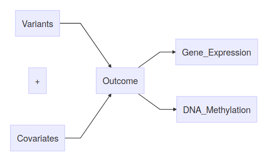

MOPower - Multi-Omics Power Calculator
================
Created and Developed by: Hamzah Syed
2019-02-01

<!--html_preserve-->

<!--/html_preserve--> 

**Co-Developers:** Georg Otto, Dan Kelberman, Chiara Bacchelli and Phil
Beales. Institution: GOSgene, Genetics and Genomic Medicine, UCL GOS
Institute of Child Health, University College London.

# Description

In recent years there has been an emergence of multi-omics studies,
which seeks to integrate information from the genome, transcriptome,
epigenome, metabolome and proteome to better understand clinical
phenotypes. Power calculators are currently available for the design of
genomic and RNA-seq experiments individually for a variety of outcomes
(binary, quantitative and survival traits). However, software is not
available which encompasses all this information together with data from
other high-throughput omics technologies. Doing this is of particular
relevance and benefit in rare disease studies where the sample size is
small. With the rapid emergence of multi-omics studies and the
complexity of information they consider, there is a need for software to
perform power calculations over a range of design scenarios and
analytical methodologies. We have developed the interactive R-shiny web
application MOPower to perform statistical data simulation and power
calculations for multi-omics studies with binary and longitudinal
outcomes. The application allows simulation of SNP, rare variant, gene
expression and methylation data over a range of rare disease study
designs (acute and chronic). MOPower offers many different integration
and analytical approaches such as joint regression modelling,
multi-factor analysis and multivariate projection-based methods. The
tool calculates the power to detect an association with the phenotype of
interest over a specified number of replicates. Sample pilot study data
can be uploaded to the application to determine the realistic
calculation of study design parameters such as fold change, average MAF
and mean gene expression, thereby increasing the accuracy of the
simulated data. With the increasing wealth of omics data from multiple
sources, arises a multitude of issues regarding data integration and
analysis. MOPower will aid in the design of multi-omics studies,
providing essential information on optimal sample size and choice of
analytical model. Consequently, this will help with the development of
future multi-omics data integration methods.

# Installation:

1.  The app is deployed on a free R shiny web server
    <https://hsyed.shinyapps.io/MOPower/>.
2.  Github MOPower page: <https://github.com/HSyed91/MOPower>.
    (Recommended) Open R studio —\> Download all the files and open
    server.R, ui.R and Packages.R in R studio —\> Install all packages
    listed in Packages.R (Most R packages will install, however if you
    require MOFA please install both the python and R version using the
    instructions on <https://github.com/bioFAM/MOFA>) —\> Click RunApp.
    Alternatively, use the following command in R to download and run
    the app from Github: shiny::runGitHub(‘MOPower’, ‘HSyed91’).

# Citation:

If you find MOPower useful, the best way to show your appreciation is
through citing. Click the DOI badge and under the 'Cite as' heading there will be a citation manager. A manuscript for MOPower is currently in production.  

# Purpose:

The purpose of MOPower is to simulate multi-omics data and calculate
power based on data integration models. MOPower is an essential tool for
designing multi-omics experiments, by providing information on optimal
sample size, choice of analytical model, false discovery rate and
cost/budget analysis. Power calculation can also be performed on single
omics features such as SNP power calculation with time-to-event
outcomes.

# Data simulation

| Genome                                           | Transcriptome                                       | Epigenome                                           | Proteome                        | Metabolome           |
| ------------------------------------------------ | --------------------------------------------------- | --------------------------------------------------- | ------------------------------- | -------------------- |
| **SNP**          | **Gene Expression** | **DNA Methylation** | Protein expression              | Metabolite profiling |
| **Rare Variant** | Alternative splicing                                | Histone Modification                                | Post-translational modification |                      |
| CNV                                              | Non-coding RNA (Long, small)                        |                                                     |                                 |                      |
| Somatic Mutations                                |                                                     |                                                     |                                 |                      |

**Blue Bold Text** - Features in current
version of software.

## Current Simulation framework:

## Outcomes

### Case-Control

  - Linear predictor model for binomial distribution simulation.

 

 

### Time-to-event

Survival analysis is typically used to analyse time-to-event data.
Time-to-event data examples include time to an adverse drug reaction,
time to myocardial infarction, time to an epileptic seizure. Survival
time for each patient is calculated with a Weibull distribution with
proportional hazards.

The baseline hazard is user-specified and controls the dispersion of the
simulated times. Censoring time for each individual is also calculated
with a Weibull distribution with shape parameter 1 indicating hazard of
censoring event is constant over time. The scale parameter is user
defined. The observed time is taken as either the event time (E), end of
study time (S) or censoring time (C), whichever occurs first and the
censoring indicator is subsequently calculated for right censored data
as:

### Longitudinal

Multiple collection times of samples at regular intervals until the end
of the study. The user needs to specify the end of the study and the
number of measurements taken during the study period. Time intervals are
evenly spread across the study period. Gene expression levels over time
will match with the sample measurement times.

## Omics + Covariate data

### SNP data:

SNP data is simulated with a random Binomial distribution where the user
specifies the mean minor allele frequency (MAF). An additive model is
assumed. The MAF determines the effect size of each SNP.

### Rare variant data:

Similar to SNP data simulation however the MAF is less than 0.01. This
is most often analysed collectively through the creation of variant
sets, burden or dispersion.

### Treatment covariate data:

Random Binomial distribution. User specifies the proportion of patients
on the test treatment.

### RNA-Seq gene expression data

The gene expression data we simulate are read counts. This is achieved
using the Negative Binomial (NB) distribution. The NB distribution
requires a mean and dispersion parameter. Gene expression is calculated
based on the outcome of interest, \(log_2\) fold change (effect size)
and the mean number of reads. The dispersion parameter is user input and
controls the spread of the simulated values. The NB distribution is a
natural choice over the Poisson distribution as it provides a better fit
for RNA-Seq data by allowing an over-dispersion parameter to capture
extra variability over the mean.

The simulation of RNA-Seq data is similar to that of Yu et al. (2017).
This paper reviews all previous simulation and power calculation tools.

### DNA methylation (array) data

The methylation data is simulated based on array as opposed to
sequencing data. Methylation data is simulated using a beta distribution
for each patient at each CpG site. The difference in methylation between
each group can be specified. To add distortion to the analysis for a
more realistic setting, hemi- and un-methylated sites can be introduced.
Influential factors include; the number of CpG sites, epigenetic risk
effect size, the variance of DNA methylation at the locus of interest
and effect size (methylation difference/odds ratio).

A methylation odds ratio is calculated for the user to know the
difference between groups of individuals. \(MM=\) mean methylation.

The simulation framework for DNA methylation is based on the work done
by Pei-Chien Tsai et al. (2015). This work was carried out with the
assumption of a case-control setting, but can be extended to survival
analysis as censored and event patients.

# Integration and Analysis models

  - Some models are best utilised for gene-level analysis and some for
    entire datasets with multiple gene data. Regression based methods
    incorporate variant data into sets or burden for rare variants and
    accumulation of gene expression levels into a set.
  - Analysis of case-control and survival data require different
    methods. Choose appropriately by reading the method articles in the
    bibliography along with the software links below.

<!-- end list -->

1.  Joint regression modelling (logistic and Cox regression).
2.  Mixed effects joint regression models.
    <https://cran.r-project.org/web/packages/lme4/lme4.pdf>
3.  Mediation analysis.
    <https://cran.r-project.org/web/packages/mediation/index.html>
4.  MOFA (Multi-omics Factor Analysis). (More info can be found on
    <https://github.com/bioFAM/MOFA>); MOFA should be used when
    including multiple gene information.
5.  Sparse partial least square regression model (with elastic net
    penalised regression to identify features); based on
    <https://github.com/xu1912/SMON>.
    <https://cran.r-project.org/web/packages/glmnet/glmnet.pdf>
6.  Joint Non-negative Matrix Factorization (NMF) - iCluster+ in
    CancerSubtypes package.
    <http://bioconductor.org/packages/release/bioc/vignettes/CancerSubtypes/inst/doc/CancerSubtypes-vignette.html>
    <https://cran.r-project.org/web/packages/iCluster/iCluster.pdf>
    <https://bioconductor.org/packages/release/bioc/vignettes/iClusterPlus/inst/doc/iManual.pdf>
7.  Similarity Network Fusion.
    <http://bioconductor.org/packages/release/bioc/vignettes/CancerSubtypes/inst/doc/CancerSubtypes-vignette.html>
8.  GLM & Cox Path with L1 penalty.
    <https://cran.r-project.org/web/packages/glmpath/index.html>
9.  Multi Co-inertia analysis. (Significance of correlation between
    omics features.)
    <http://bioconductor.org/packages/release/bioc/html/omicade4.html>

# Output

  - Power to detect an association with the outcome of interest (the
    difference between groups/individuals). The discovered association
    incorporates variant, gene expression and methylation data to
    identify an expression quantitative trait loci (eQTL) or the
    methylation quantitative trait loci (meQTL). Inferences can also be
    made on the relationship between different omics features
    (interaction). The statistic of importance from each analysed
    dataset is the \(p\)-value. This is calculated dependent on the
    selection of the analysis model. The likelihood ratio statistic and
    the Wald test are the two most common procedures.

## Likelihood ratio test:

The LRT is used to compare two statistical models (i.e. the null and
alternative), given by:

The \(p\)-value is derived using the difference between model
log-likelihoods. The probability distribution of the test statistic is
approximately a \(\chi^2\) distribution with degrees of freedom equal to
the number of free parameters between the alternative and null models.

## Wald test:

The \(p\)-value for each regression parameter is calculated using.
Alternative tests for calculating the significance of explanatory
variables in a model or comparing two models exist, such as the Wald
test and likelihood ratio test (LRT). The Wald test statistic is given
by:

I(theta) is the expected Fisher information matrix. theta\_{Null} is the
proposed values (null model). The assumption is that the difference
between theta and theta\_{Null} will be approximately normally
distributed. The Wald test statistic can be used to calculate the
p-value for each model parameter in the Weibull, Cox PH or another
regression model.

## Power estimation procedure

1.  Specify all input parameters: simulations, sample size, number of
    genes/variants, mean gene expression, fold change between groups,
    type I error rate, etc…  
2.  Simulate data from statistical distributions using the input
    parameters.  
3.  Fit integration and statistical models to obtain the test statistics
    (Wald or LRT) under both the null and alternative hypotheses.  
4.  Calculate power for the specified input parameters. Power is equal
    to the number of replicates \(\rho\) for which \(p\) \< type I error
    rate. The quantity is shown as a percentage of the total number of
    simulations.

<!-- end list -->

  - A sample dataset is printed to the screen and interactively changes
    as the user adjusts input parameters. This is so that the user can
    visualise if the correct data is being simulated to match their
    design. Analysis summary tables are output, such as the power based
    on sample size which is also displayed in graphical form. The
    Analysis of one dataset is output to ensure that the analysis is run
    correctly and for the user to help interpret the output.

  - FDR (Benjamini-Hochberg) - The false discovery rate is a measure for
    controlling the type I error rate in the presence of multiple
    testing. It is the expected proportion of rejected null hypotheses
    which are false. It is a less conservative procedure compared with
    the Bonferroni correction.

  - Bonferroni correction - Significance threshold calculated based on
    the number of genes analysed. The probability of one or more false
    rejections among all comparisons.

# User interface

MOPower is an R shiny web application that is entirely interactive and
user-friendly. No coding experience needed, just an understanding of
multi-omics experiments. The software will modify the interface options
depending on user selections of omics and type of outcome. There are
useful tooltips and messages that pop-up while you are using the
software.

**Front end with reactive datatable**

# Future development pipeline

MOPower is currently in phase 1 of its development. The current
implementation of the software is v1.0.1. Future versions will
incorporate:

  - Pilot data simulation using bootstrapping. One way of achieving this
    is by analysing the data and using bootstrapping to simulate data
    based on results.
  - Machine learning methods for analysis.
  - Simulated data based on different populations using 1000 genomes
    project data.
  - Simulation of more omics data features (see table).

# References

Ching, T., Huang, S., & Garmire, L. X. (2014). Power analysis and sample
size estimation for RNA-Seq differential expression. RNA, 20(11),
1684-1696. <doi:10.1261/rna.046011.114>

Li, C. I., & Shyr, Y. (2016). Sample size calculation based on
generalized linear models for differential expression analysis in
RNA-seq data. Stat Appl Genet Mol Biol, 15(6), 491-505.
<doi:10.1515/sagmb-2016-0008>

Miller, F., Zohar, S., Stallard, N., Madan, J., Posch, M., Hee, S. W., .
. . Day, S. (2018). Approaches to sample size calculation for clinical
trials in rare diseases. Pharm Stat, 17(3), 214-230.
<doi:10.1002/pst.1848>

Plan, E. L. (2014). Modeling and simulation of count data. CPT
Pharmacometrics Syst Pharmacol, 3, e129. <doi:10.1038/psp.2014.27>

Poplawski, A., & Binder, H. (2017). Feasibility of sample size
calculation for RNA-seq studies. Brief Bioinform.
<doi:10.1093/bib/bbw144>

Syed, H., Jorgensen, A. L., & Morris, A. P. (2016). SurvivalGWAS\_Power:
a user friendly tool for power calculations in pharmacogenetic studies
with “time to event” outcomes. BMC Bioinformatics, 17(1), 523.
<doi:10.1186/s12859-016-1407-9>

Tsai, P. C., & Bell, J. T. (2015). Power and sample size estimation for
epigenome-wide association scans to detect differential DNA methylation.
Int J Epidemiol, 44(4), 1429-1441. <doi:10.1093/ije/dyv041>

Wu, H., Wang, C., & Wu, Z. (2015). PROPER: comprehensive power
evaluation for differential expression using RNA-seq. Bioinformatics,
31(2), 233-241. <doi:10.1093/bioinformatics/btu640>

Yu, L., Fernandez, S., & Brock, G. (2017). Power analysis for RNA-Seq
differential expression studies. BMC Bioinformatics, 18(1), 234.
<doi:10.1186/s12859-017-1648-2>

Argelaguet, R., Velten, B., Arnol, D., Dietrich, S., Zenz, T., Marioni,
J. C., . . . Stegle, O. (2018). Multi-Omics Factor Analysis-a framework
for unsupervised integration of multi-omics data sets. Mol Syst Biol,
14(6), e8124.

Huang, S., Chaudhary, K., & Garmire, L. X. (2017). More Is Better:
Recent Progress in Multi-Omics Data Integration Methods. Front Genet, 8,
84. <doi:10.3389/fgene.2017.00084>

Rohart, F., Gautier, B., Singh, A., & Le Cao, K. A. (2017). mixOmics: An
R package for ’omics feature selection and multiple data integration.
PLoS Comput Biol, 13(11), e1005752. <doi:10.1371/journal.pcbi.1005752>

Sun, Y. V., & Hu, Y. J. (2016). Integrative Analysis of Multi-omics Data
for Discovery and Functional Studies of Complex Human Diseases. Adv
Genet, 93, 147-190. <doi:10.1016/bs.adgen.2015.11.004>

Wang, B., Mezlini, A. M., Demir, F., Fiume, M., Tu, Z., Brudno, M., . .
. Goldenberg, A. (2014). Similarity network fusion for aggregating data
types on a genomic scale. Nat Methods, 11(3), 333-337.
<doi:10.1038/nmeth.2810>

<https://www.bioconductor.org/packages/devel/bioc/vignettes/CancerSubtypes/inst/doc/CancerSubtypes-vignette.html>
